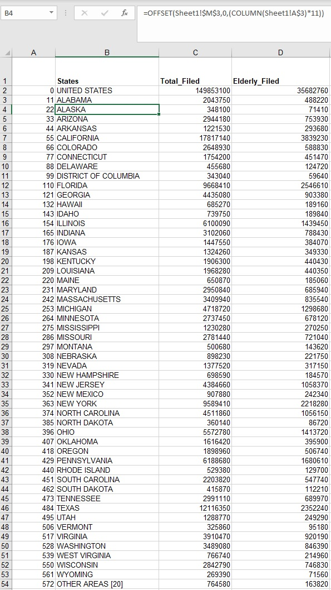
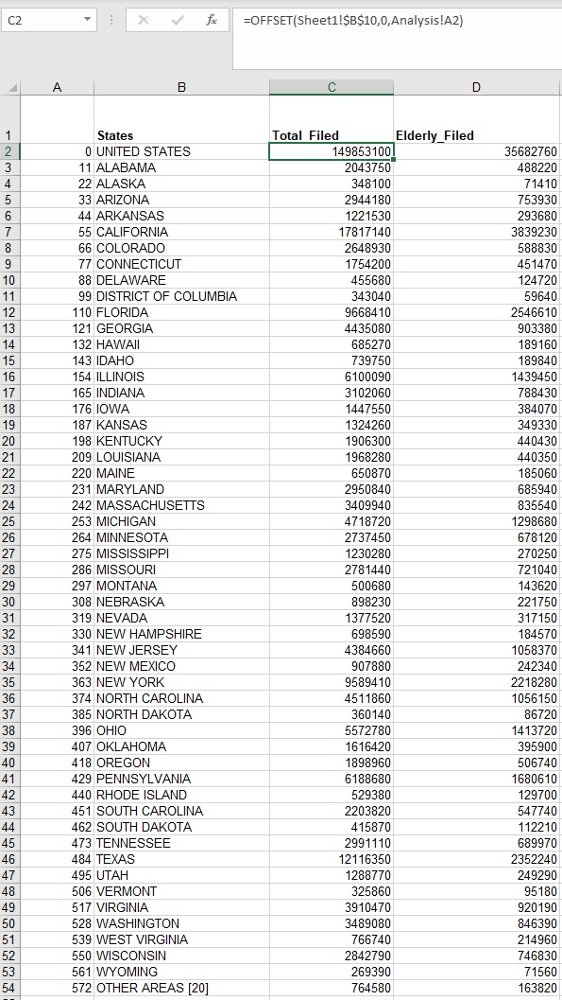
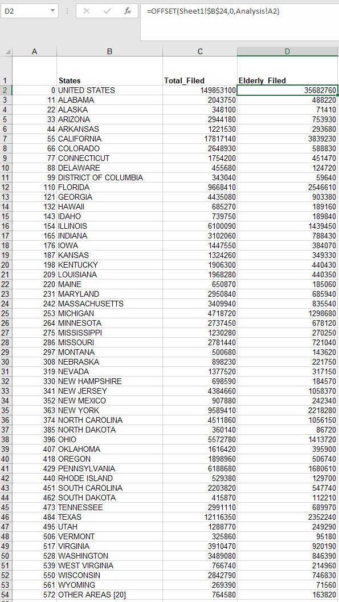
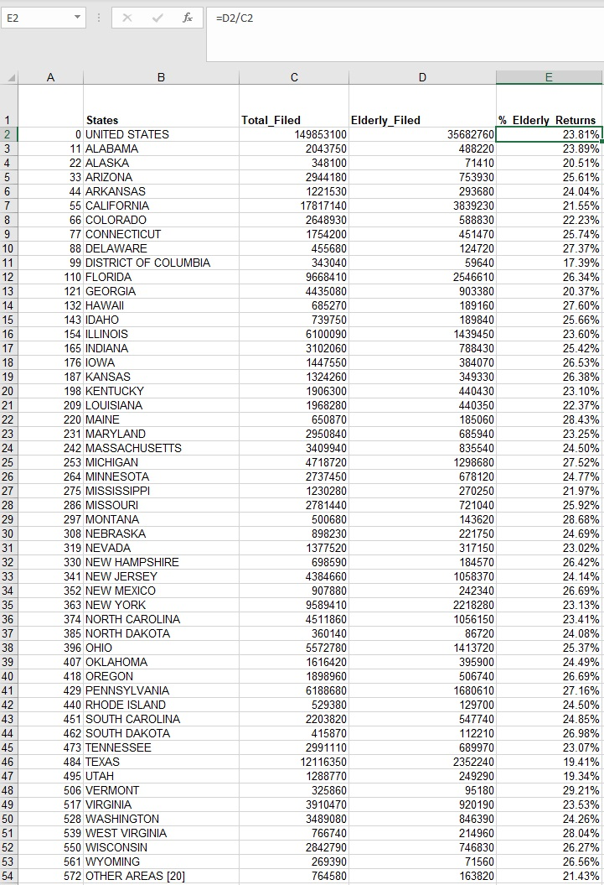
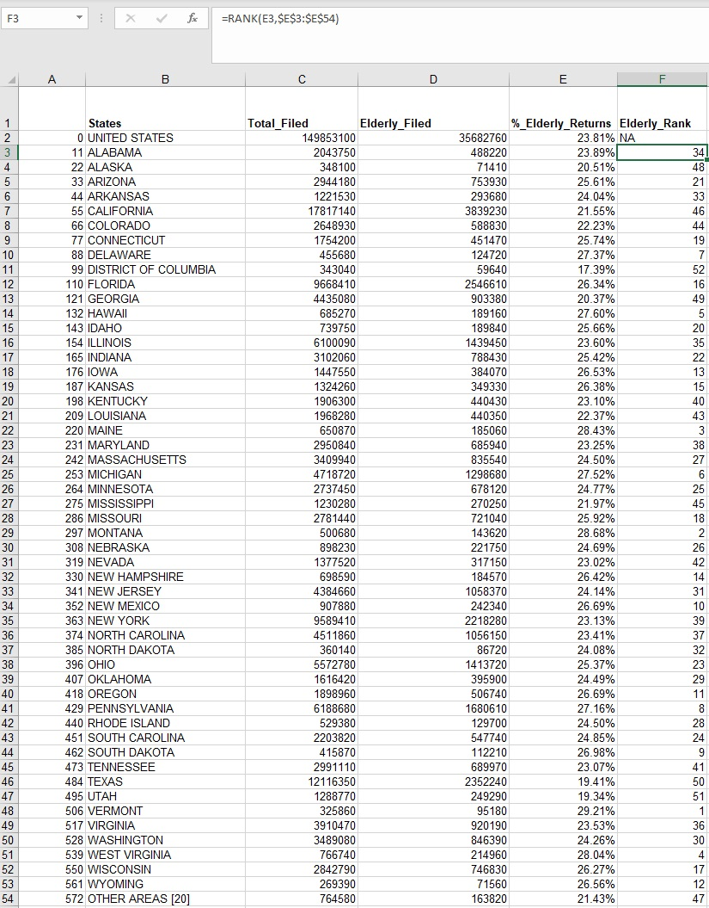
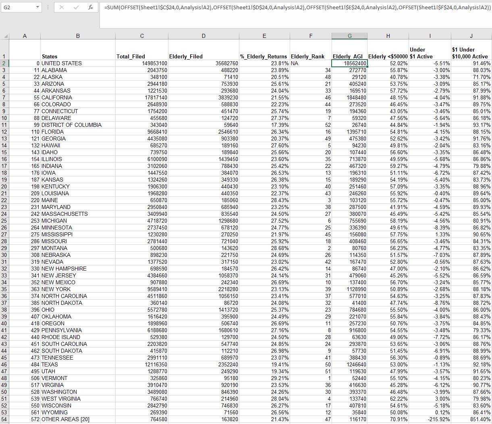
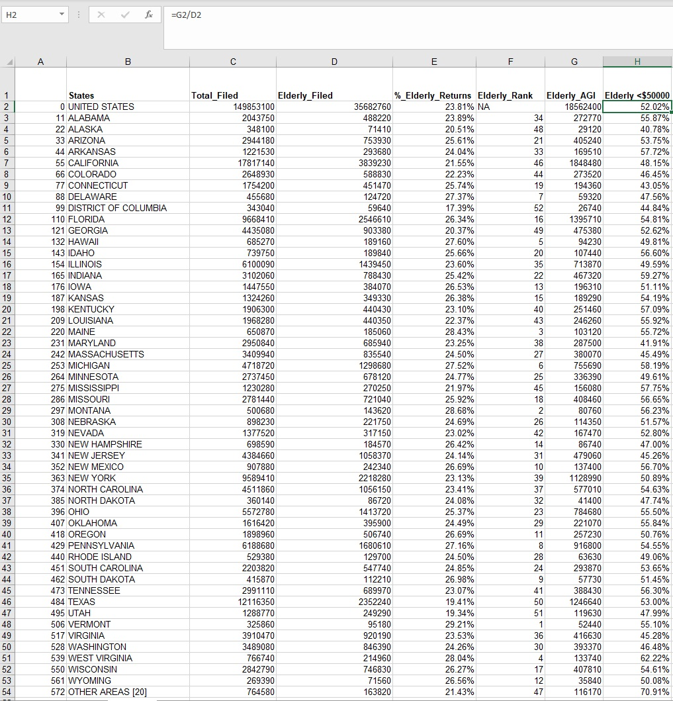
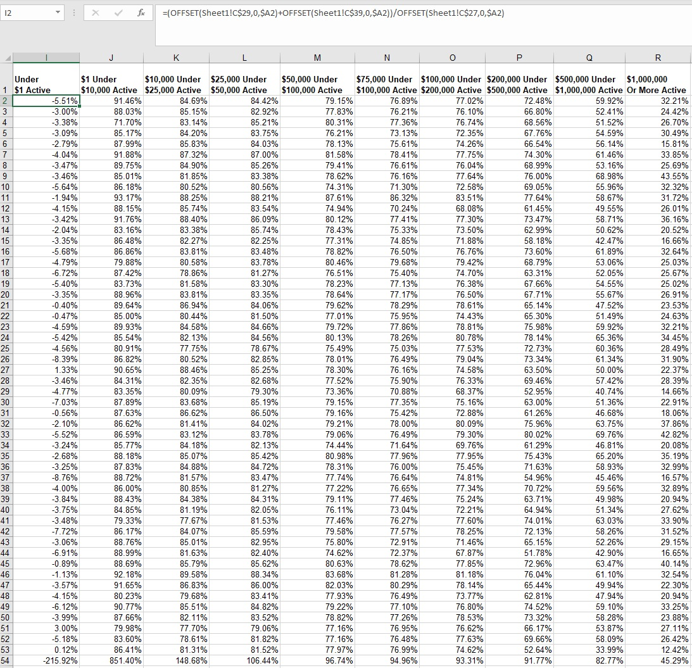
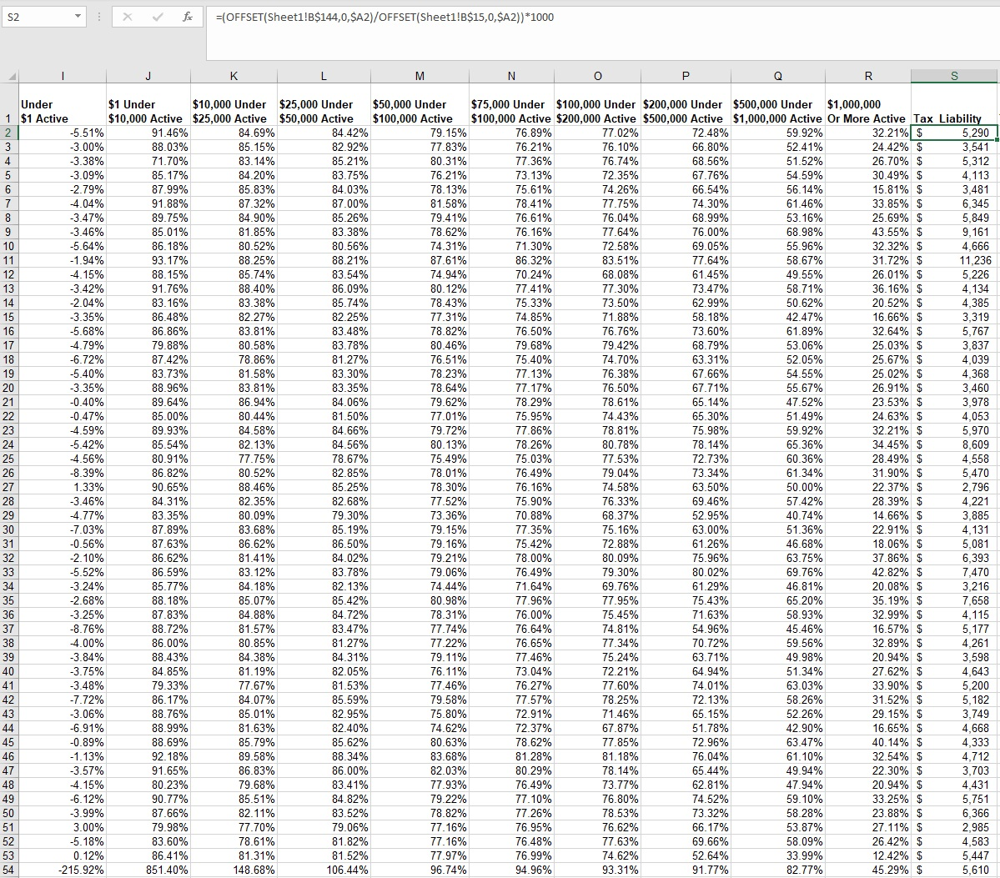
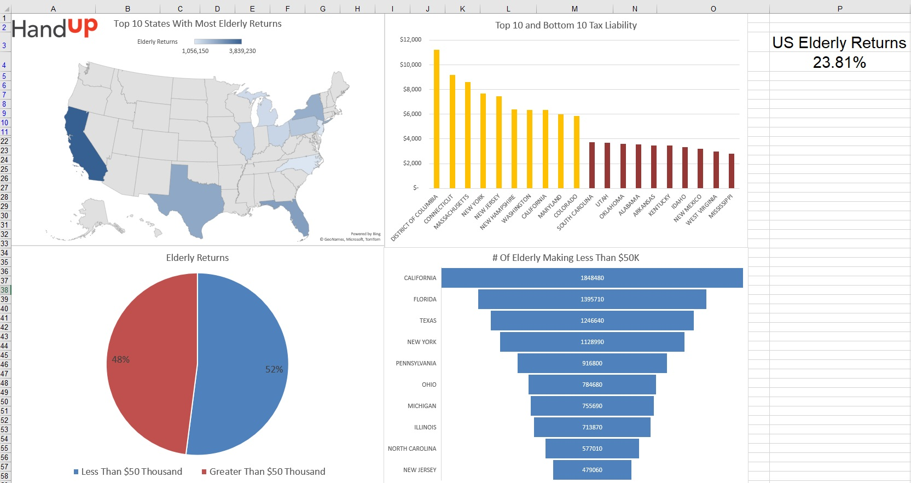

# low-income-elderly-assist-project

# Introduction
For this project my team was assigned with analyzing 2016 tax data and creating an Interactive Excel Dashboard to help inform low income and elderly assistance grants for our partner Hand Up America. Hand Up America is an organization that assists low income and elderly taxpayers. For this project we used Excel.

Data Sources: Data for this project was provided by NSS

# Table of Contents
* [Introduction](#Introduction)
* [Excel Walkthrough](#Excel-Walkthrough)
* [Excel Dashboard](#Excel-Dashboard)

# Excel Walkthrough
1. For the first step I need to create a table that will contain the state names, number of total returns filed, and the number of elderly returns filed. Sadly, due to the sensitive nature of the dataset, I am only able to show aggregated data.

2. For the second step I needed to have a row for every state, so I used the `OFFSET` function to take every state from the original dataset and move it over to my analysis sheet. There were a lot of empty cells between each state, so I nested in a `COLUMN` function to make sure every time I called the function, it moved the right amount of columns over.

3. For the third step, I needed to find out how many people filed tax returns for every state. I used the `OFFSET` function to gather the total tax returns for each state. In column `A` I created a multiplier based on the previous step that I could use to iterate through the original dataset. This way, every time I call a cell next to a state in the `OFFSET` function, it multiplies by the number of columns I need to move over.

4. The fourth step involved a very similar process as the step before, using the `OFFSET` function to find how many elderly filed tax returns for each state.

5. For the fifth step I needed to find what percentage of returns were elderly for each state. I calculated this by dividing the total filed column by the elderly filed column and converting the outcome to a percentage.

6. I wanted to see which states had the highest percentage of elderly tax returns, and for this step I used the `RANK` function.

7. For the seventh step I wanted to see the elderly Adjusted Gross Income under 50k by state, so I used the `OFFSET` function and summed up every income bracket under 50k.

8. For the eighth step I wanted to find out the percentage of elderly tax returns were under the 5ok income bracket for each state. I divided the elderly AGI column by the elderly filed column and converted the outcome to a percentage.

9. For the ninth step I want to find what percentage of income is active for each income bracket in the dataset. For this, I needed to write an `OFFSET` function that can take values from each state and income bracket. That way I can drag the function across multiple rows and columns and it will populate for every income bracket.

10. The tenth step is where I execute the function mentioned in the previous step. I add the passive and active income `OFFSET` functions and divide them by the total income `OFFSET` function, making sure to use absolute cell reference on only specific parts of the functions, to ensure the process can be repeatable.

11. For the eleventh step I wanted to find the tax liability for each state, so I used the `OFFSET` function to divide the total tax liability by the number of exemptions and multiplied by 1000.

12. The final step involves creating an Interactive Excel Dashboard showing some of our team's findings to Hand Up America.

# Excel Dashboard

1. The top left chart shows the top states with the most elderly returns.

2. The bottom left chart shows the percentage of elderly returns less than 50k and the percentage of elderly returns greater than 50k.

3. The top right chart shows the top ten and bottom ten states for tax liability.

4. the bottom right chart shows the number of elderly making less than 50k by state

5. the KPI in the very top right shows the percentage of elderly returns for the entire United States.
